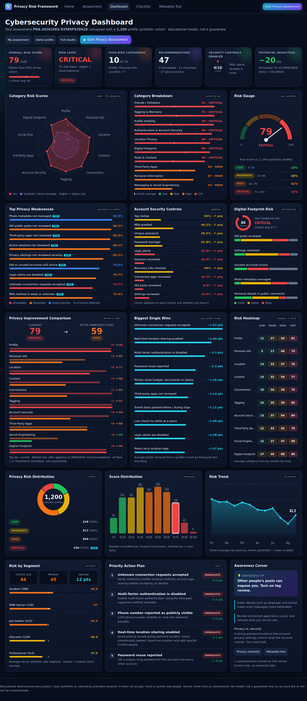

# Social Media Privacy Risk Assessment Framework

> **This project is designed for defensive cybersecurity and privacy education. It uses synthetic or voluntarily provided assessment responses and does not scrape, track, or profile real social-media users.**



## Overview
A privacy-risk assessment platform. A user answers **53 questions about social-media settings and habits** (never the sensitive data itself) and receives a **0-100 Privacy Risk Score**, risk level, 10 category scores, ranked weaknesses, prioritised recommendations, a what-if simulator, a printable checklist, an HTML/PDF report and an analytics dashboard built on a **1,200-record synthetic dataset**.

## Problem Statement
Oversharing and weak settings (public phone number, live location, no MFA, open tagging…) make doxxing, impersonation and social engineering easier. People rarely get structured, explainable feedback about their exposure.

## Objectives
Assess exposure in 10 areas · explain every point of the score · recommend prioritised fixes · simulate improvements · educate · practise privacy-by-design.

## Cybersecurity Relevance
Security awareness, privacy engineering, GRC, IAM (MFA/recovery/sessions/third-party grants), SOC-style account-takeover hygiene and application security (validation, XSS, rate limiting, secure headers, tests). See [docs/01_PROJECT_EXPLANATION.md](docs/01_PROJECT_EXPLANATION.md).

## Privacy vs Security
Privacy = control over what information is exposed. Security = protecting accounts from unauthorised access. **Strong account security ≠ strong privacy**: a strong password and MFA do not hide a public phone number and live location.

## Features
53-question wizard · input validation · feature extraction · 10 category scores · configurable weighted overall score · LOW/MODERATE/HIGH/CRITICAL · findings engine · recommendation engine (IMMEDIATE / IMPORTANT / GOOD PRACTICE) · **improvement simulator** · **dense analytics dashboard (15 panels)** · printable checklist · HTML/PDF report · local photo-metadata viewer/cleaner · SQLite privacy-first storage · REST API · 54 automated tests.

## Architecture
```
User → Questionnaire → Validation → Feature Extraction → Category Analyzers
     → Scoring Engine → Overall Risk → Findings → Recommendations → Dashboard → Report
```
Details and diagrams: [docs/02_ARCHITECTURE_AND_API.md](docs/02_ARCHITECTURE_AND_API.md).

## Technology Stack
Python 3.10+ · Flask · SQLite · Pillow (metadata tool) · HTML/CSS/vanilla JS · hand-written SVG charts (no CDN, works offline) · pytest.

## Privacy Questionnaire
53 questions in 10 categories A-J → [docs/QUESTIONNAIRE.md](docs/QUESTIONNAIRE.md). Answers are PUBLIC/FRIENDS/PRIVATE, YES/NO/SOMETIMES/NOT SURE, etc. No phone numbers, addresses, passwords or birth dates are ever typed.

## Risk Categories & Weights
Profile 10 · Personal Info 15 · Location 15 · Content 10 · Connections 10 · Tagging 5 · Account Security 15 · Third-Party Apps 5 · Social Engineering 10 · Digital Footprint 5 (configurable in `backend/config.py` or `CATEGORY_WEIGHTS_JSON`).

## Risk Scoring
`category = 100 × Σ(w·risk)/Σw`, `overall = Σ(categoryWeight × category)/Σ weights`. **0-20 LOW · 21-40 MODERATE · 41-70 HIGH · 71-100 CRITICAL.** Higher = higher exposure. *Weights and thresholds are educational assumptions and must be validated before professional risk decisions. The score is not a guarantee that an account will or will not be compromised.*

## Privacy Findings / Recommendation Engine / Improvement Simulator
`generate_privacy_findings()` ranks risky answers by exact points; `generate_recommendations()` prioritises fixes; `simulate_improvement()` re-scores a copy of your answers with chosen fixes ("72 → 34, risk reduction 38"). Labelled as a *framework simulation*.

## Digital Footprint · Social Engineering Awareness · Account Security
Covered by categories J, I and G, with defensive guidance in the docs (no attack scripts or message templates exist in this repo).

## Privacy Dashboard
Open `/dashboard`: 6 KPI cards, radar, category breakdown, gauge, top weaknesses, account-security controls, digital-footprint panel, before/after comparison, biggest single wins, heat-map, risk distribution, histogram, 12-month trend, segment comparison, action plan and awareness corner. Works with your own assessment or the fictional demo profile.

## Privacy Report
`/api/assessment/{id}/report` → standalone HTML (Assessment ID, date, score, level, categories, findings, recommendations, priority actions, checklist, disclaimer). Use *Print → Save as PDF*. No sensitive data included.

## Privacy by Design
Data minimisation (only scores + finding types stored, never answers) · purpose limitation · least privilege · privacy by default (127.0.0.1) · transparency · user control (delete) · retention limitation (30 days) · secure processing.

## Installation
```bash
# 1. Create project folder and unzip / clone into it
cd Social-Media-Privacy-Risk-Assessment
# 2. Virtual environment
python -m venv .venv
source .venv/bin/activate          # Windows: .venv\Scripts\activate
# 3. Dependencies
pip install -r requirements.txt
# 4. (optional) regenerate the synthetic dataset
python data/generate_dataset.py
# 5. Start (backend + frontend are served together)
python -m backend.app
# 6. Open http://127.0.0.1:5000
```

## Usage
1. Open **Assessment** (or click *Fill with demo profile*). 2. Answer all 10 sections → *Calculate my score*. 3. Review score, category radar, findings, recommendations. 4. Tick fixes in the **Simulator** and watch the score change. 5. Open **Dashboard** to compare with the cohort. 6. *View report* → Print → Save as PDF. 7. Use **Checklist** and the **Metadata Tool**. 8. *Delete my assessment* when done.

## API Documentation
See [docs/02_ARCHITECTURE_AND_API.md](docs/02_ARCHITECTURE_AND_API.md). Main routes: `POST /api/assessment`, `GET /api/assessment/{id}`, `GET /api/assessment/{id}/recommendations`, `POST /api/assessment/simulate-improvement`, `GET /api/dashboard/stats`, `GET /api/privacy-checklist`, `DELETE /api/assessment/{id}`.

## Testing
```bash
python -m pytest -v                 # 54 tests
python -m tests.run_test_report     # regenerates docs/TEST_REPORT.md
python scripts/generate_docs.py     # regenerates QUESTIONNAIRE / DEMO_RESULTS / RISK_MATRIX docs
```
## Security & Privacy Testing
See [docs/SECURITY_PRIVACY_TESTING.md](docs/SECURITY_PRIVACY_TESTING.md).

## Results
Fictional demo profile: **79/100 CRITICAL → 50/100 HIGH** after the brief's improvements (−29 pts) - [docs/DEMO_RESULTS.md](docs/DEMO_RESULTS.md). Synthetic cohort (n=1,200): average ≈ 44; ~18% LOW, 26% MODERATE, 42% HIGH, 13% CRITICAL.

## Limitations
Self-reported answers · assumed (not empirically calibrated) weights · synthetic data · platform settings change · measures exposure, not likelihood of compromise.

## Future Improvements
Platform-specific checklists · organisational policies · awareness quizzes · privacy-maturity scoring · family/teen modules · enterprise training · GRC reporting · calibration · localisation · accessibility · report comparison over time · local-only mode. No scraping or invasive monitoring.

## Screenshots
See [`screenshots/`](screenshots/) and the checklist in [docs/04_GITHUB_AND_PROOF.md](docs/04_GITHUB_AND_PROOF.md).

## Learning Outcomes
Risk modelling · privacy engineering · secure API design · threat modelling · data analytics · testing · ethical, defensive project scoping.

## Ethical Disclaimer
Defensive education only. Use synthetic or your own voluntary answers. Do not use this project to scrape, profile, track or access any real person's accounts.

## Author
*Your Name* - Cybersecurity student · [LinkedIn](#) · [GitHub](#)
